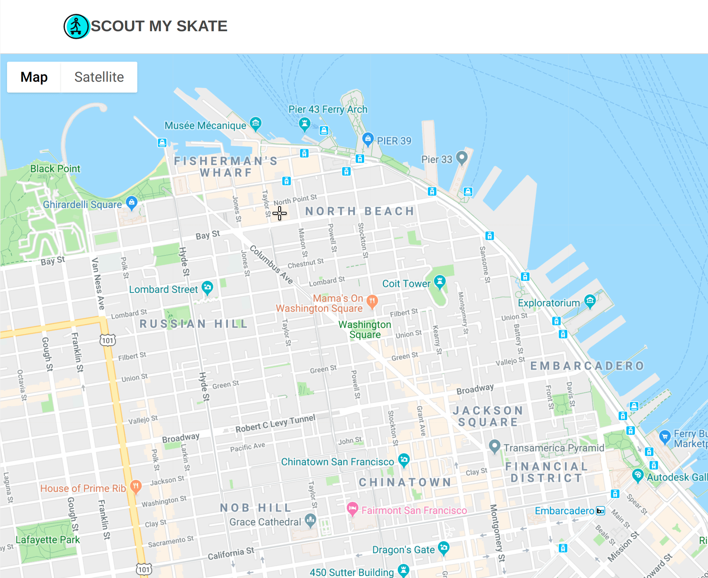

## README

* This README documents the steps necessary to get the application up and running.
* Welcome to Scout My Skate, the Map My Run clone for skate lovers.
* [Scout My Skate Live](https://scout-my-skate.herokuapp.com/#/)

# Setup
* git clone the repo with the url: https://github.com/AmandaMitchell707/ScoutMySkate
* `gem install`
* `bundle install`
* `npm install`
* `bundle exec rails db:setup` -to create database files and seed the database
* `npm start`
The project should then be available at the address `localhost:3000` in your browser

# Dependencies
* `Ruby version 2.5.1`, `NodeJS`, and `PostgreSQL version 10` installed on your machine

* Requires Install of `NodeJS` for node-package-manager (`npm`)

* The frontend is compiled with `webpack` that generates a `bundle.js` file from the entrypoint file `/frontend/scout_my_skate.jsx`.

    * The routes for this webpack configuration can be fount in the `webpack.config.js` file

# Functionality
* Users can use Google map to create skate routes anywhere in the world. The map is set to the user's location by default, but they can also search for any location in which to create a new skate route.

```javascript
setUsersPosition(map) {
  let pos;
  if (navigator.geolocation) {
    navigator.geolocation.getCurrentPosition(position => {
      pos = {
        lat: position.coords.latitude,
        lng: position.coords.longitude,
      };
      map.setCenter(pos);
    });
  }
}

initMap() {
  let map = new google.maps.Map(this.refs.map, mapOptions);
  this.setUsersPosition(map);
  this.directionsDisplay.setMap(map);
  this.map = map;

  this.map.addListener('click', event => {
    this.addMarker({ lat: event.latLng.lat(), lng: event.latLng.lng() });
    this.calcAndDisplayRoute(this.directionsService, this.directionsDisplay);
  });
  this.addLocationAutocomplete();
}
```
* Users can then save and view the details and map of their skate routes.


